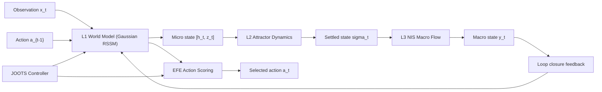

# ASL v1

Reference implementation of the Active Strange Loop (ASL) architecture in PyTorch.

## Layout

- `models/`: RSSM, attractor dynamics, macro-state flow, JOOTS controller
- `training/`: phased trainers (phase1-phase6 + real-data variants)
- `envs/`: RandomWalk1D, T-Maze, non-stationary gridworld, ambiguity-trap environments
- `optim/`: adaptive optimizer (Adam + SAM hooks + SGLD noise)
- `benchmarks/`: strict multi-seed benchmark harness with confidence intervals
- `utils/`: seeding, device selection, logging
- `scripts/test_level1.py`: mandatory level-1 convergence script
- `scripts/run_benchmarks.py`: strict benchmark runner (`--profile legacy|phase6`, `--mode smoke|full`)
- `scripts/run_phases.py`: runs the full training pipeline (phase1 -> phase5)
- `scripts/run_phase6.py`: phase1 -> phase6 reliability pipeline with staged sigma coupling and EI audits
- `scripts/run_phase6_real_data.py`: phase6 reliability pipeline on real-data checkpoints/datasets
- `scripts/train_real_data.py`: offline-first real-data training with masked sequences, AMP/accum, early-stop, checkpoint-resume
- `scripts/run_real_benchmarks.py`: multi-seed real-data benchmark harness with CI thresholds
- `scripts/check_real_benchmark_regression.py`: regression gate against locked baseline benchmark JSON
- `tests/`: unit and integration tests

## Model Architecture

ASL is a layered world-model architecture. Instead of learning one monolithic latent space, it learns:
- a **micro-level predictive model** (`h_t`, `z_t`) for moment-to-moment dynamics,
- a **stability layer** (`sigma_t`) that settles noisy micro-states,
- a **macro-level state** (`y_t`) used for higher-level consistency and loop closure.

### Architecture at a glance



### Components

1. `models/rssm.py` (`GaussianRSSM`, level L1)
   - Core recurrent state-space model with deterministic memory (`h_t`) and stochastic latent state (`z_t`).
   - Learns a prior/posterior latent distribution each step and optimizes VFE-style losses (reconstruction + KL).
   - Includes policy, reward, and value heads used by imagined planning (`EFEScorer`).
   - Supports vector or image observations, discrete or continuous actions, and optional normalization.

2. `models/attractor.py` (`AttractorDynamics`, level L2)
   - Takes micro-state features (`[h_t, z_t]`) and iteratively "settles" them to a stable attractor state (`sigma_t`).
   - Adds spectral-radius control to keep dynamics stable and prevent exploding recurrent behavior.
   - Provides a micro-state reconstruction path used as an additional consistency signal.

3. `models/nis.py` (`NISMacroState` + `MacroTransition`, level L3)
   - Uses an invertible flow to map attractor state into:
     - macro variables (`y_t`) and
     - residual/noise variables (`z_noise`).
   - Trains a macro transition model over `y_t` and measures directional information-flow proxies (dEI).
   - Enables intervention/audit-style checks in Phase 6 by comparing proxy and audit signals.

4. `models/joots.py` (`JOOTSController`)
   - Watches training signals (VFE trend, gradient SNR proxy, attractor residual).
   - Detects stagnation and triggers controlled escapes:
     - mild: increase exploration temperature / force epistemic foraging,
     - severe: optimizer perturbations (SGLD noise, temporary SAM mode).
   - Supports cooldown and recovery logic so escapes are bounded and reversible.

### How the loop closes

- Early phases learn components mostly separately (world model -> attractor -> macro).
- In Phase 5, macro state `y_t` is fed back into the world-model encoder, creating the "strange loop."
- In Phase 6, sigma-prior coupling is ramped in stages; each stage is gate-checked and can be retried/rolled back.

### Why this design is different

- **Hierarchical state**: separate micro (`h,z`), meso (`sigma`), and macro (`y`) representations.
- **Reliability-first training**: staged non-regression gates, CI-based checks, checkpointed stage artifacts.
- **Built-in anti-stagnation control**: JOOTS is part of the training loop, not an external script.

## Quickstart

```bash
python3 -m venv .venv
source .venv/bin/activate
pip install -e .
python -m pytest -q
python scripts/test_level1.py
python scripts/run_phases.py --quick
python scripts/run_benchmarks.py --profile phase6 --mode smoke
```

Device selection:
- default: auto-pick `mps` on Apple Silicon when available, otherwise `cpu`
- force CUDA: add `--cuda`
- force MPS: add `--mps`
- force CPU: add `--cpu`

## Real Data Training

Supported dataset inputs:
- directory of episode `.npz` files (`obs`, `action`, optional `reward`, `done`, `timestamp`)
- single batched `.npz` (`obs_seq`, `act_seq`, optional `reward_seq`, `done_seq`, `timestamp_seq`)
- `.jsonl` (one episode per line)
- `.csv` (step rows grouped by `episode_id`)

Train on real trajectories:

```bash
python scripts/train_real_data.py \
  --data-source /path/to/episodes.npz \
  --action-space-type discrete \
  --action-dim 3 \
  --obs-likelihood gaussian \
  --steps 2000 \
  --use-amp
```

Live metrics (TensorBoard) are written by default under `runs/real_data/<timestamp>/tb`:

```bash
tensorboard --logdir runs/real_data --port 6006
```

If TensorBoard fails with `ModuleNotFoundError: No module named 'pkg_resources'` (setuptools>=82),
use the compatibility launcher:

```bash
python scripts/tensorboard_compat.py --logdir runs/real_data --port 6006
```

Optional online fine-tuning after offline pretrain:

```bash
python scripts/train_real_data.py \
  --data-source /path/to/episodes.npz \
  --online-env tmaze \
  --online-episodes 32 \
  --online-steps 300 \
  --online-fraction 0.2
```

Real-data evaluation gates are included in the training summary (`nll`, `kl`, temporal drift, intervention trend).

Run strict multi-seed real-data benchmark CI:

```bash
python scripts/run_real_benchmarks.py \
  --data-source /path/to/episodes.npz \
  --profile pusht \
  --seeds 7,11,19,23,29 \
  --output runs/benchmarks/real_data_summary.json
```

Use a fixed reference checkpoint (skip per-seed retraining) with:

```bash
python scripts/run_real_benchmarks.py \
  --data-source data/lerobot_pusht_npz \
  --profile pusht \
  --action-space-type continuous \
  --action-dim 2 \
  --obs-likelihood gaussian \
  --seeds 7,11,19,23,29 \
  --reference-checkpoint runs/phase6_real_data/baseline_phase6_real_pass.pt \
  --checkpoint-mode strict \
  --output runs/benchmarks/real_data_reference_summary.json
```

Run Phase 6 directly on real-data checkpoints:

```bash
python scripts/run_phase6_real_data.py \
  --data-source data/lerobot_pusht_npz \
  --action-space-type continuous \
  --action-dim 2 \
  --resume-checkpoint runs/real_data_pusht/<timestamp>/final_world_model.pt \
  --checkpoint-mode strict \
  --quick \
  --mps \
  --output-dir runs/phase6_real_data
```

### Quickstart: LeRobot PushT

```bash
pip install -e '.[hf]'
python scripts/convert_lerobot_pusht.py \
  --dataset-id lerobot/pusht \
  --split train \
  --output-dir data/lerobot_pusht_npz

python scripts/train_real_data.py \
  --data-source data/lerobot_pusht_npz \
  --action-space-type continuous \
  --action-dim 2 \
  --obs-likelihood gaussian \
  --seq-len 32 \
  --batch-size 32 \
  --steps 2000

python scripts/run_real_benchmarks.py \
  --data-source data/lerobot_pusht_npz \
  --profile pusht \
  --action-space-type continuous \
  --action-dim 2 \
  --obs-likelihood gaussian \
  --seeds 7,11,19,23,29 \
  --output runs/benchmarks/real_data_summary.json
```

## Modern Runtime Hygiene

Use an isolated project venv and run the hygiene check:

```bash
python scripts/check_runtime.py --strict
```

If legacy packages are detected (`gym`, `shimmy`, `pynvml`), clean the active venv:

```bash
pip uninstall -y gym shimmy pynvml
pip install -U gymnasium nvidia-ml-py
```

## Strict Benchmarks

Run the deferred benchmark battery (T-Maze + non-stationary attractor + ambiguity-trap JOOTS):

```bash
python scripts/run_benchmarks.py \
  --profile phase6 \
  --mode full \
  --seeds 7,11,19,23,29 \
  --output runs/benchmarks/strict_summary.json
```

`legacy` profile keeps mean-threshold gates for backward compatibility.
`phase6` profile enforces CI-bound gates (lower-bound/upper-bound checks).

The command exits with a non-zero code if any gate fails. Use `--no-fail-on-threshold` for exploratory runs.
Add `--show-runtime-health` to print package hygiene diagnostics for the active Python environment.

## Phase 6 Reliability Runner

Run the staged sigma-prior + EI-audit reliability cycle and write reproducible artifacts:

```bash
python scripts/run_phase6.py --output-dir runs/phase6
```

Artifacts are written to `runs/phase6/<timestamp>/`:
- `summary.json`
- `stage_metrics.csv`
- `gates.json`
- per-stage checkpoints under `checkpoints/`

`stage_metrics.csv` includes per-stage T-Maze sigma ablation fields (`with_sigma` CI and `without_sigma` CI delta).

## CI

Workflows:
- `.github/workflows/ci.yml`
- `.github/workflows/nightly_benchmarks.yml`

PR CI runs:
- `python -m pytest -q`
- `python scripts/test_level1.py --steps 220 --num-sequences 192 --seq-len 20 --batch-size 32`
- `python scripts/run_benchmarks.py --profile phase6 --mode smoke`

Nightly runs:
- `python scripts/run_benchmarks.py --profile phase6 --mode full`
- download locked real-data checkpoint via `ASL_REAL_REFERENCE_CHECKPOINT_URL` secret + SHA256 verify
- `python scripts/run_real_benchmarks.py --profile pusht ... --reference-checkpoint runs/baselines/phase6_real_pusht_v1_model.pt`
- `python scripts/check_real_benchmark_regression.py --candidate ... --baseline configs/baselines/phase6_real_pusht_v1.benchmark.json`
- uploads benchmark JSON artifact on every run (pass/fail)

Set this GitHub Actions secret for deterministic nightly real-data benchmarking:
- `ASL_REAL_REFERENCE_CHECKPOINT_URL`: direct download URL for the locked checkpoint binary

## Notes

- Core runtime is CPU-first, CUDA optional.
- WandB support is optional and auto-disabled when unavailable.
- Cross-level gradients are detached during phase 1-3 trainers by design.
- Real-data trainers use masked sequence batches and support discrete or continuous actions.
